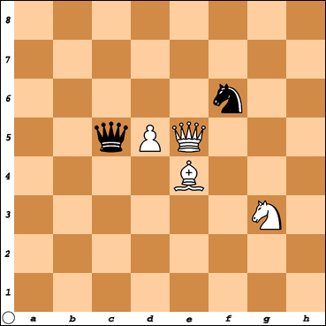

Feature list
============
This file will describe the list of features that were used in the checkmate classfifer.
The feature will be divided to 3 groups:

1. Simple count features 
2. First Degree Neighbors
3. First to Third Degree Neighbors

The Results directory describe which set of features and set of input was used. 

##Feature Description
###Simple count features

+ <b>total</b> - The total amount of pieces on the board
+ <b>white</b> - The total amount of Upper case pieces on the board (white pieces) 
+ <b>black</b> - The total amount of Upper case pieces on the board (white pieces)
+ <b>b</b> 	- The total amount of "b" pieces (case insensetive) on the board (Bishop pieces from both side)
+ <b>k</b> 	- The total amount of "k" pieces (case insensetive) on the board (King pieces from both side)
+ <b>n</b> 	- The total amount of "n" pieces (case insensetive) on the board (kNight pieces from both side)
+ <b>p</b> 	- The total amount of "p" pieces (case insensetive) on the board (Pawn pieces from both side)
+ <b>q</b> 	- The total amount of "q" pieces (case insensetive) on the board (Queen pieces from both side)
+ <b>r</b> 	- The total amount of "r" pieces (case insensetive) on the board (Rock pieces from both side)

for each X in [b,k,n,p,q,r,B,K,N,P,Q,R]:
+ <b>single_side_\<X\></b> 	- The total amount of \<X\> pieces on the board (case sensetive - count for each side sepereatly)

###First Degree Neighbors

for each X in [b,k,n,p,q,r,B,K,N,P,Q,R]: 
+ <b>single_side_\<X\>_empty_1</b> 	- The amount of empty pieces around the \<X\> piece ( were the cartesian distance is smaller than 2 )
+ <b>single_side_\<X\>_same_side_1</b> 	- The amount of empty pieces around the \<X\> piece ( were the cartesian distance is smaller than 2 )
+ <b>single_side_\<X\>_other_side_1</b> 	- The amount of empty pieces around the \<X\> piece ( were the cartesian distance is smaller than 2 )

Calculated Boolean features from other features
for each X in [b,k,n,p,q,r,B,K,N,P,Q,R]:
+ <b>single_side_\<X\>_threat_1</b> 	- single_side_\<X\>_same_side_1 > single_side_\<X\>_other_side_1 
+ <b>single_side_\<X\>_mostly_empty_1</b> 	- single_side_\<X\>_empty_1 > ( single_side_\<X\>_same_side_1 + <b>single_side_\<X\>_other_side_1 )
+ <b>single_side_\<X\>_mostly_more_empty_than_good_1</b> 	- single_side_\<X\>_empty_1 > single_side_\<X\>_same_side_1
+ <b>single_side_\<X\>_mostly_more_empty_than_bad_1</b> 	- single_side_\<X\>_empty_1 > single_side_\<X\>_other_side_1
+ <b>single_side_\<X\>_other_side_exist_1</b> 	- single_side_\<X\>_other_side_1

####Explenation/ Example about First Degree
for example for X == Q ( White Queen):

single_side_Q_empty_1 = 4 
single_side_Q_same_side_1 = 2 
single_side_Q_other_side_1 = 2 

#####Commnets:
+ The edge of the board is not counted.
+ Two pieces from the same type and side are aggregated into one feature. -  This comment is not intuative and might be better if this calculation was made for each piece, and an aggregation would occur on the calculated features. ammount of pieces in thread and so on ...

###First to Third Degree Neighbors

This Features are very similar to the First Degree Neighbors

for each X in [b,k,n,p,q,r,B,K,N,P,Q,R]:
+ <b>single_side_\<X\>_empty_2</b> 	- The amount of empty pieces around the \<X\> piece ( were the cartesian distance is smaller than 3 )
+ <b>single_side_\<X\>_same_side_2</b> 	- The amount of empty pieces around the \<X\> piece ( were the cartesian distance is smaller than 3 )
+ <b>single_side_\<X\>_other_side_2</b> 	- The amount of empty pieces around the \<X\> piece ( were the cartesian distance is smaller than 3 )

+ <b>single_side_\<X\>_empty_3</b> 	- The amount of empty pieces around the \<X\> piece ( were the cartesian distance is smaller than 4 )
+ <b>single_side_\<X\>_same_side_3</b> 	- The amount of empty pieces around the \<X\> piece ( were the cartesian distance is smaller than 4 )
+ <b>single_side_\<X\>_other_side_3</b> 	- The amount of empty pieces around the \<X\> piece ( were the cartesian distance is smaller than 4 )

####Explenation/ Example about First Degree
For example for X == Q ( White Queen):

Example for 2 degree ( were the cartesian distance is smaller than 3 ):

 
single_side_Q_empty_1 = 5 
single_side_Q_same_side_1 = 2 
single_side_Q_other_side_1 = 1 
single_side_Q_empty_2 = 19 
single_side_Q_same_side_2 = 3 
single_side_Q_other_side_2 = 2 

Example for 3 degree:

 
single_side_Q_empty_1 = 5 
single_side_Q_same_side_1 = 2 
single_side_Q_other_side_1 = 1 
single_side_Q_empty_2 = 19 
single_side_Q_same_side_2 = 3 
single_side_Q_other_side_2 = 2 
single_side_Q_empty_3 = 41 
single_side_Q_same_side_3 = 3 
single_side_Q_other_side_3 = 4 

Calculated Boolean features from other features
+ <b>single_side_\<X\>_threat_2 
+ <b>single_side_\<X\>_mostly_empty_2 
+ <b>single_side_\<X\>_mostly_more_empty_than_good_2 
+ <b>single_side_\<X\>_mostly_more_empty_than_bad_2 
+ <b>single_side_\<X\>_other_side_exist_2 
+ <b>single_side_\<X\>_threat_3 
+ <b>single_side_\<X\>_mostly_empty_3 
+ <b>single_side_\<X\>_mostly_more_empty_than_good_3 
+ <b>single_side_\<X\>_mostly_more_empty_than_bad_3 
+ <b>single_side_\<X\>_other_side_exist_3 

###Full Feature List
+ total
+ white
+ black
+ b
+ k
+ n
+ p
+ q
+ r
+ single_side_b
+ single_side_b_empty_1
+ single_side_b_same_side_1
+ single_side_b_other_side_1
+ single_side_b_threat_1
+ single_side_b_mostly_empty_1
+ single_side_b_mostly_more_empty_than_good_1
+ single_side_b_mostly_more_empty_than_bad_1
+ single_side_b_other_side_exist_1
+ single_side_b_empty_2
+ single_side_b_same_side_2
+ single_side_b_other_side_2
+ single_side_b_threat_2
+ single_side_b_mostly_empty_2
+ single_side_b_mostly_more_empty_than_good_2
+ single_side_b_mostly_more_empty_than_bad_2
+ single_side_b_other_side_exist_2
+ single_side_b_empty_3
+ single_side_b_same_side_3
+ single_side_b_other_side_3
+ single_side_b_threat_3
+ single_side_b_mostly_empty_3
+ single_side_b_mostly_more_empty_than_good_3
+ single_side_b_mostly_more_empty_than_bad_3
+ single_side_b_other_side_exist_3
+ single_side_B
+ single_side_B_empty_1
+ single_side_B_same_side_1
+ single_side_B_other_side_1
+ single_side_B_threat_1
+ single_side_B_mostly_empty_1
+ single_side_B_mostly_more_empty_than_good_1
+ single_side_B_mostly_more_empty_than_bad_1
+ single_side_B_other_side_exist_1
+ single_side_B_empty_2
+ single_side_B_same_side_2
+ single_side_B_other_side_2
+ single_side_B_threat_2
+ single_side_B_mostly_empty_2
+ single_side_B_mostly_more_empty_than_good_2
+ single_side_B_mostly_more_empty_than_bad_2
+ single_side_B_other_side_exist_2
+ single_side_B_empty_3
+ single_side_B_same_side_3
+ single_side_B_other_side_3
+ single_side_B_threat_3
+ single_side_B_mostly_empty_3
+ single_side_B_mostly_more_empty_than_good_3
+ single_side_B_mostly_more_empty_than_bad_3
+ single_side_B_other_side_exist_3
+ single_side_k
+ single_side_k_empty_1
+ single_side_k_same_side_1
+ single_side_k_other_side_1
+ single_side_k_threat_1
+ single_side_k_mostly_empty_1
+ single_side_k_mostly_more_empty_than_good_1
+ single_side_k_mostly_more_empty_than_bad_1
+ single_side_k_other_side_exist_1
+ single_side_k_empty_2
+ single_side_k_same_side_2
+ single_side_k_other_side_2
+ single_side_k_threat_2
+ single_side_k_mostly_empty_2
+ single_side_k_mostly_more_empty_than_good_2
+ single_side_k_mostly_more_empty_than_bad_2
+ single_side_k_other_side_exist_2
+ single_side_k_empty_3
+ single_side_k_same_side_3
+ single_side_k_other_side_3
+ single_side_k_threat_3
+ single_side_k_mostly_empty_3
+ single_side_k_mostly_more_empty_than_good_3
+ single_side_k_mostly_more_empty_than_bad_3
+ single_side_k_other_side_exist_3
+ single_side_K
+ single_side_K_empty_1
+ single_side_K_same_side_1
+ single_side_K_other_side_1
+ single_side_K_threat_1
+ single_side_K_mostly_empty_1
+ single_side_K_mostly_more_empty_than_good_1
+ single_side_K_mostly_more_empty_than_bad_1
+ single_side_K_other_side_exist_1
+ single_side_K_empty_2
+ single_side_K_same_side_2
+ single_side_K_other_side_2
+ single_side_K_threat_2
+ single_side_K_mostly_empty_2
+ single_side_K_mostly_more_empty_than_good_2
+ single_side_K_mostly_more_empty_than_bad_2
+ single_side_K_other_side_exist_2
+ single_side_K_empty_3
+ single_side_K_same_side_3
+ single_side_K_other_side_3
+ single_side_K_threat_3
+ single_side_K_mostly_empty_3
+ single_side_K_mostly_more_empty_than_good_3
+ single_side_K_mostly_more_empty_than_bad_3
+ single_side_K_other_side_exist_3
+ single_side_n
+ single_side_n_empty_1
+ single_side_n_same_side_1
+ single_side_n_other_side_1
+ single_side_n_threat_1
+ single_side_n_mostly_empty_1
+ single_side_n_mostly_more_empty_than_good_1
+ single_side_n_mostly_more_empty_than_bad_1
+ single_side_n_other_side_exist_1
+ single_side_n_empty_2
+ single_side_n_same_side_2
+ single_side_n_other_side_2
+ single_side_n_threat_2
+ single_side_n_mostly_empty_2
+ single_side_n_mostly_more_empty_than_good_2
+ single_side_n_mostly_more_empty_than_bad_2
+ single_side_n_other_side_exist_2
+ single_side_n_empty_3
+ single_side_n_same_side_3
+ single_side_n_other_side_3
+ single_side_n_threat_3
+ single_side_n_mostly_empty_3
+ single_side_n_mostly_more_empty_than_good_3
+ single_side_n_mostly_more_empty_than_bad_3
+ single_side_n_other_side_exist_3
+ single_side_N
+ single_side_N_empty_1
+ single_side_N_same_side_1
+ single_side_N_other_side_1
+ single_side_N_threat_1
+ single_side_N_mostly_empty_1
+ single_side_N_mostly_more_empty_than_good_1
+ single_side_N_mostly_more_empty_than_bad_1
+ single_side_N_other_side_exist_1
+ single_side_N_empty_2
+ single_side_N_same_side_2
+ single_side_N_other_side_2
+ single_side_N_threat_2
+ single_side_N_mostly_empty_2
+ single_side_N_mostly_more_empty_than_good_2
+ single_side_N_mostly_more_empty_than_bad_2
+ single_side_N_other_side_exist_2
+ single_side_N_empty_3
+ single_side_N_same_side_3
+ single_side_N_other_side_3
+ single_side_N_threat_3
+ single_side_N_mostly_empty_3
+ single_side_N_mostly_more_empty_than_good_3
+ single_side_N_mostly_more_empty_than_bad_3
+ single_side_N_other_side_exist_3
+ single_side_p
+ single_side_p_empty_1
+ single_side_p_same_side_1
+ single_side_p_other_side_1
+ single_side_p_threat_1
+ single_side_p_mostly_empty_1
+ single_side_p_mostly_more_empty_than_good_1
+ single_side_p_mostly_more_empty_than_bad_1
+ single_side_p_other_side_exist_1
+ single_side_p_empty_2
+ single_side_p_same_side_2
+ single_side_p_other_side_2
+ single_side_p_threat_2
+ single_side_p_mostly_empty_2
+ single_side_p_mostly_more_empty_than_good_2
+ single_side_p_mostly_more_empty_than_bad_2
+ single_side_p_other_side_exist_2
+ single_side_p_empty_3
+ single_side_p_same_side_3
+ single_side_p_other_side_3
+ single_side_p_threat_3
+ single_side_p_mostly_empty_3
+ single_side_p_mostly_more_empty_than_good_3
+ single_side_p_mostly_more_empty_than_bad_3
+ single_side_p_other_side_exist_3
+ single_side_P
+ single_side_P_empty_1
+ single_side_P_same_side_1
+ single_side_P_other_side_1
+ single_side_P_threat_1
+ single_side_P_mostly_empty_1
+ single_side_P_mostly_more_empty_than_good_1
+ single_side_P_mostly_more_empty_than_bad_1
+ single_side_P_other_side_exist_1
+ single_side_P_empty_2
+ single_side_P_same_side_2
+ single_side_P_other_side_2
+ single_side_P_threat_2
+ single_side_P_mostly_empty_2
+ single_side_P_mostly_more_empty_than_good_2
+ single_side_P_mostly_more_empty_than_bad_2
+ single_side_P_other_side_exist_2
+ single_side_P_empty_3
+ single_side_P_same_side_3
+ single_side_P_other_side_3
+ single_side_P_threat_3
+ single_side_P_mostly_empty_3
+ single_side_P_mostly_more_empty_than_good_3
+ single_side_P_mostly_more_empty_than_bad_3
+ single_side_P_other_side_exist_3
+ single_side_q
+ single_side_q_empty_1
+ single_side_q_same_side_1
+ single_side_q_other_side_1
+ single_side_q_threat_1
+ single_side_q_mostly_empty_1
+ single_side_q_mostly_more_empty_than_good_1
+ single_side_q_mostly_more_empty_than_bad_1
+ single_side_q_other_side_exist_1
+ single_side_q_empty_2
+ single_side_q_same_side_2
+ single_side_q_other_side_2
+ single_side_q_threat_2
+ single_side_q_mostly_empty_2
+ single_side_q_mostly_more_empty_than_good_2
+ single_side_q_mostly_more_empty_than_bad_2
+ single_side_q_other_side_exist_2
+ single_side_q_empty_3
+ single_side_q_same_side_3
+ single_side_q_other_side_3
+ single_side_q_threat_3
+ single_side_q_mostly_empty_3
+ single_side_q_mostly_more_empty_than_good_3
+ single_side_q_mostly_more_empty_than_bad_3
+ single_side_q_other_side_exist_3
+ single_side_Q
+ single_side_Q_empty_1
+ single_side_Q_same_side_1
+ single_side_Q_other_side_1
+ single_side_Q_threat_1
+ single_side_Q_mostly_empty_1
+ single_side_Q_mostly_more_empty_than_good_1
+ single_side_Q_mostly_more_empty_than_bad_1
+ single_side_Q_other_side_exist_1
+ single_side_Q_empty_2
+ single_side_Q_same_side_2
+ single_side_Q_other_side_2
+ single_side_Q_threat_2
+ single_side_Q_mostly_empty_2
+ single_side_Q_mostly_more_empty_than_good_2
+ single_side_Q_mostly_more_empty_than_bad_2
+ single_side_Q_other_side_exist_2
+ single_side_Q_empty_3
+ single_side_Q_same_side_3
+ single_side_Q_other_side_3
+ single_side_Q_threat_3
+ single_side_Q_mostly_empty_3
+ single_side_Q_mostly_more_empty_than_good_3
+ single_side_Q_mostly_more_empty_than_bad_3
+ single_side_Q_other_side_exist_3
+ single_side_r
+ single_side_r_empty_1
+ single_side_r_same_side_1
+ single_side_r_other_side_1
+ single_side_r_threat_1
+ single_side_r_mostly_empty_1
+ single_side_r_mostly_more_empty_than_good_1
+ single_side_r_mostly_more_empty_than_bad_1
+ single_side_r_other_side_exist_1
+ single_side_r_empty_2
+ single_side_r_same_side_2
+ single_side_r_other_side_2
+ single_side_r_threat_2
+ single_side_r_mostly_empty_2
+ single_side_r_mostly_more_empty_than_good_2
+ single_side_r_mostly_more_empty_than_bad_2
+ single_side_r_other_side_exist_2
+ single_side_r_empty_3
+ single_side_r_same_side_3
+ single_side_r_other_side_3
+ single_side_r_threat_3
+ single_side_r_mostly_empty_3
+ single_side_r_mostly_more_empty_than_good_3
+ single_side_r_mostly_more_empty_than_bad_3
+ single_side_r_other_side_exist_3
+ single_side_R
+ single_side_R_empty_1
+ single_side_R_same_side_1
+ single_side_R_other_side_1
+ single_side_R_threat_1
+ single_side_R_mostly_empty_1
+ single_side_R_mostly_more_empty_than_good_1
+ single_side_R_mostly_more_empty_than_bad_1
+ single_side_R_other_side_exist_1
+ single_side_R_empty_2
+ single_side_R_same_side_2
+ single_side_R_other_side_2
+ single_side_R_threat_2
+ single_side_R_mostly_empty_2
+ single_side_R_mostly_more_empty_than_good_2
+ single_side_R_mostly_more_empty_than_bad_2
+ single_side_R_other_side_exist_2
+ single_side_R_empty_3
+ single_side_R_same_side_3
+ single_side_R_other_side_3
+ single_side_R_threat_3
+ single_side_R_mostly_empty_3
+ single_side_R_mostly_more_empty_than_good_3
+ single_side_R_mostly_more_empty_than_bad_3
+ single_side_R_other_side_exist_3
